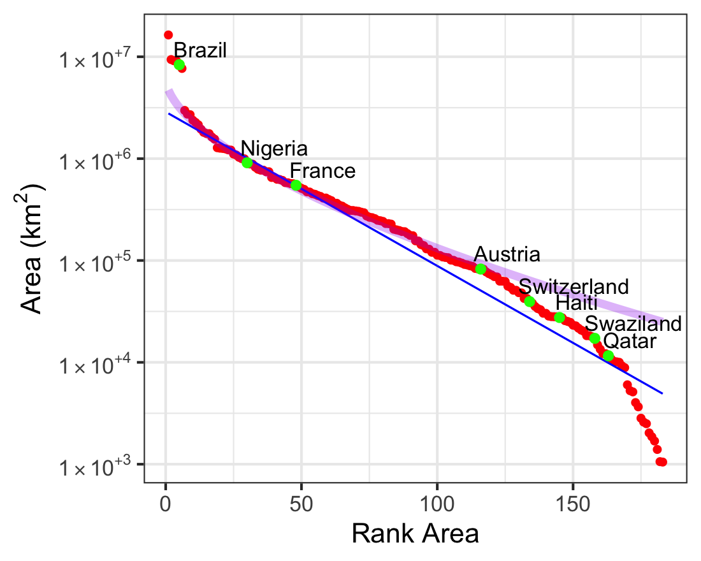

# World Data with Stretched Exponential

Fitting a stretched exponential function to world data.

## Data

The World Data is downloaded first from the web and saved into a file using `make.data.R`. 

## Areas of Countries

The blue line is the best exponential fit. A stretched exponential function (purple) with the exponent 0.6, fits better, but breaks down for countries smaller than about 80,000 km^2. Created with `area_stretched_exp.R`.

## Populations of Countries

The blue line is the best exponential fit. A stretched exponential function (purple) with the exponent 0.4, fits better, but breaks down for countries with fewer than a million inhabitants. Created with `population_stretched_exp.R`.

